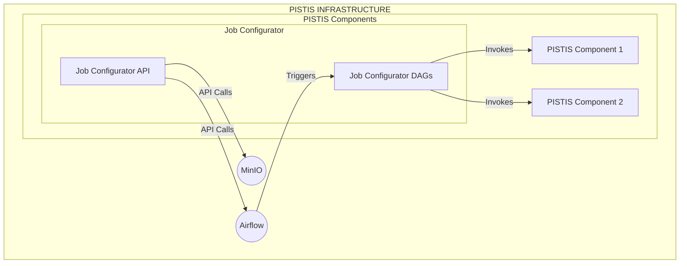

<!--
 Copyright © 2026 Bull® SAS. All rights reserved
 
 Licensed under the Apache License, Version 2.0 (the "License");
 you may not use this file except in compliance with the License.
 You may obtain a copy of the License at
 
     http://www.apache.org/licenses/LICENSE-2.0
 
 Unless required by applicable law or agreed to in writing, software
 distributed under the License is distributed on an "AS IS" BASIS,
 WITHOUT WARRANTIES OR CONDITIONS OF ANY KIND, either express or implied.
 See the License for the specific language governing permissions and
 limitations under the License.
-->

# Pistis Job Configurator

Pistis Job Configurator is a flexible, extensible data pipeline orchestrator designed to manage, execute, and monitor complex data workflows for the PISTIS European Project. It leverages Apache Airflow for workflow scheduling and execution, integrates with MinIO for object storage, and exposes a REST API for workflow configuration and management.

---

## Architecture

Pistis Job Configurator is designed to operate as a middle layer between external Apache Airflow and MinIO instances. The architecture consists of:

- **External Airflow**: Responsible for scheduling and executing workflows (DAGs). Airflow is not deployed by this project and must be available as an external service.
- **External MinIO**: Used for object storage. MinIO is also expected to be deployed externally.
- **app/**: Contains the main access point (Flask REST API) for the component, which interacts with both Airflow and MinIO to manage workflows and data.
- **dags/**: Contains the Airflow DAGs that define the workflows to be executed. The app component triggers these DAGs via Airflow's API.

This separation allows the Pistis Job Configurator to orchestrate complex workflows by leveraging Airflow for execution and MinIO for storage, while exposing a unified API for configuration and management.

### Architecture Diagram



## Table of Contents
- [Project Structure](#project-structure)
- [Architecture](#architecture)
- [Deployment](#deployment)
- [Job Configurator API](#job-configurator-api)
- [DAGs and Workflow Documentation](#dags-and-workflow-documentation)
- [External Components Integration](#external-components-integration)

---

## Project Structure

```
├── app/                  # Main application code (Flask REST API, models, routes)
│   ├── models/
│   │   └── workflow_parser.py   # Workflow API payload and schema definitions
│   └── routes/
│       └── workflow.py         # Workflow orchestration REST endpoints
├── dags/                 # Airflow DAG definitions (workflows)
├── deployments/          # Deployment scripts and Dockerfiles
├── templates/            # JSON templates for workflow/job configuration
├── tests/                # Functional and integration tests
├── pyproject.toml        # Python project configuration
├── README.md             # This documentation
└── ...
```

---

## Deployment


### Prerequisites
- Python 3.8+
- [Poetry](https://python-poetry.org/) (for dependency management)
- External Apache Airflow instance (with PythonOperator, HTTPOperator, etc.)
- External MinIO server (for object storage)
- Docker (for containerized deployment)
- Environment variables for Airflow, MinIO, and service endpoints

### Installing the dependencies
This project uses [Poetry](https://python-poetry.org/) for dependency management. To install dependencies:

```bash
poetry install
```

### Deployment

Deployment is performed using the Docker Compose file located in the `deployments/` directory:

```bash
cd deployments
docker compose up -d
```

**Note:** The provided Docker Compose file only deploys the Pistis Job Configurator app. It does **not** deploy Airflow or MinIO. You must have external Airflow and MinIO instances running and accessible to the app.

### Environment Configuration
- Copy `.env.example` to `.env` and fill in the required values (MinIO, Airflow, etc.)

### Running the Flask API (Development)
```bash
export FLASK_APP=app
flask run
```

### Accessing Airflow UI
- Typically at http://localhost:8080 (if using a local/external Airflow instance)

---

## Job Configurator API

The Job Configurator exposes a REST API (via Flask-RESTX) for orchestrating data workflows. The main endpoints are defined in `app/routes/workflow.py` and the expected payloads in `app/models/workflow_parser.py`.

### Endpoints

#### 1. `/workflow/run` (POST)
**Description:** Launch a new workflow execution.
**Payload:**
    - `dataset` (file, optional): Dataset file to process
    - `workflow` (string, required): JSON string describing the workflow (see schema below)
    - `dataset_name` (string, optional): Name of the dataset
    - `dataset_description` (string, optional): Description

**Workflow Schema Example:**
```json
{
    "workflow": [
        {
            "prev_run": "000",
            "job_name": "test_job",
            "source": "http://dataset.pistis",
            "endpoint": "http://service.endpoint",
            "input_data": [
                {"name": "param1", "value": "value1"}
            ],
            "method": "get",
            "destination_type": "memory"
        }
    ]
}
```

**Returns:**
    - `dag_id`, `dag_run_id`, status, message

#### 2. `/workflow/fetchWorkflowRun` (POST)
**Description:** Fetch the results/status of a workflow execution.
**Payload:**
    - `runId` (string, required): Workflow run identifier

#### 3. `/workflow/stopWorkflowRun` (DELETE)
**Description:** Stop a running workflow execution.
**Payload:**
    - `runId` (string, required): Workflow run identifier

#### 4. `/workflow/getWorkflowRunList` (POST)
**Description:** List workflow executions for a given workflow ID. This method queries the Airflow API and returns the whole workflow metadata. ___This metadata includes the dataset content for each workflow run, which may lead to performance issues when the dataset is large.___
**Payload:**
    - `workflow_id` (string, required): Workflow identifier

#### 5. `/workflow/getWorkflowRunListPaginated` (POST)
**Description:** Paginated list of workflow executions. This method queries directly the Airflow metadata database (bypassing the Airflow API) for workflow runs, removing the dataset content from the results received.
**Payload:**
    - `workflow_id` (string, required): Workflow identifier
    - `workflow_limit` (int, optional): Number of runs to return (default: 30)
    - `workflow_offset` (int, optional): Offset for pagination (default: 0)
**IMPORTANT:** Due to a filtering on the results retrieved after the query, the results returned may be less than the `workflow_limit` specified in the request.

#### 6. `/workflow/simplifiedRun` (POST)
**Description:** Launch a workflow with a simplified schema (array of jobs with name, id, params, etc.)

### Payload Schemas

- **Job Object:**
    - `job_name` (string): Name of the job
    - `source` (string): Data source (URL, job, workflow, etc.)
    - `endpoint` (string): Service endpoint
    - `input_data` (array): List of parameters (name, value)
    - `method` (string): HTTP method (`get`, `post`, `put`, `delete`)
    - `destination_type` (string): Output destination (`memory`, `factory_storage`, `nifi`)
    - `response_dataset_field_path` (string, optional)
    - `response_metadata_field_path` (string, optional)
    - `lineage_tracker` (boolean, optional)

- **Job Param Object:**
    - `name` (string): Parameter name
    - `value` (string): Parameter value

---

## DAGs and Workflow Documentation

This project includes several Airflow DAGs for orchestrating data jobs and workflows. Each DAG is defined in the `dags/` directory.

### 1. pistis_workflow_dag.py
**Purpose:**
    - Orchestrates a generic workflow consisting of multiple jobs, each with its own configuration.
    - Accepts a `workflow` parameter (array of job objects) and executes them in sequence or as defined.
**Key Features:**
    - Supports job chaining, parameter passing, and result tracking.
    - Integrates with MinIO for data storage.
    - Uses Airflow's PythonOperator and custom logic for job execution.

### 2. pistis_workflow_dag_periodic.py
**Purpose:**
    - Similar to `pistis_workflow_dag.py` but designed for periodic (scheduled) workflow execution.
    - Supports scheduling via Airflow's cron or interval triggers.
**Key Features:**
    - Adds support for periodic triggers and time-based workflow management.

### 3. pistis_job_dag.py
**Purpose:**
    - Defines a single job execution DAG with rich parameterization.
    - Accepts a `job_data` parameter (object with job configuration).
**Key Features:**
    - Handles data ingestion, transformation, and storage.
    - Integrates with MinIO, external APIs, and supports multiple data formats (CSV, Parquet, JSON, etc.).
    - Includes utility functions for data cataloguing, encryption, and access policy notification.

### 4. pistis_job_dag_periodic.py
**Purpose:**
    - Periodic version of the job DAG for scheduled job execution.
    - Useful for recurring ETL/data processing tasks.
**Key Features:**
    - Adds scheduling and periodic execution logic.

### 5. pistis_fingerprint_dag.py
**Purpose:**
    - Specialized DAG for calculating dataset fingerprints (e.g., MinHash signatures) for similarity detection.
    - Retrieves datasets from MinIO, computes fingerprints, and stores results back in MinIO.
**Key Features:**
    - Supports multiple fingerprinting methods (`adhoc_minhash`, `datasketch_minhash`).
    - Parameterized for dataset ID, source, and method.
    - Logs and error handling for robust operation.

---

## Templates

The `templates/` directory contains JSON templates for job and workflow configuration, used by the API and DAGs for dynamic job creation.

---

## External Components Integration

The Pistis Job Configurator integrates with other PISTIS components using the JSON templates provided in the `templates/` directory. These templates define the structure for data check-in, data transformation, data distribution, and insights generation, among others. Other PISTIS components interact with the Job Configurator by submitting workflow/job configurations that conform to these templates, enabling seamless orchestration and interoperability across the PISTIS ecosystem.

Refer to the `templates/` directory for examples and documentation on how to structure integration payloads for different PISTIS components.

---

## Testing

Functional and integration tests are provided in the `tests/` directory. Use `pytest` or your preferred test runner to execute them.

---

## License

Licensed under the Apache License, Version 2.0. See [LICENSE](LICENSE) for details.
